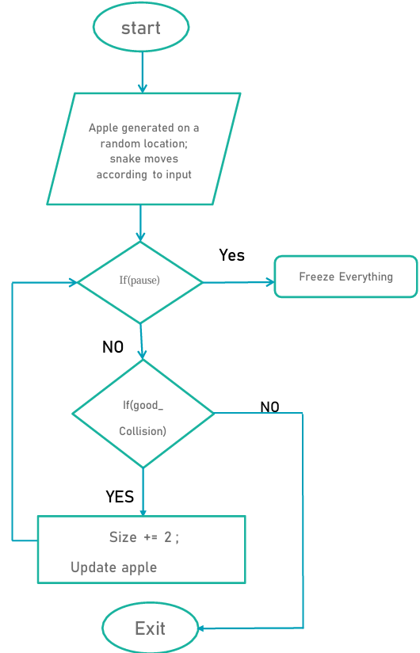

# Snake and Apple Game using Verilog
This repository contains the Verilog implementation of the **Snake and Apple Game** developed for the course **ECL 106: Digital System Design with HDL**. The game runs on an **Altera DE10-Lite FPGA** board, displayed on a **VGA monitor**. Players control the snake to eat randomly appearing apples while avoiding collisions. Each time the snake consumes an apple, its length increases, making the game progressively more challenging.
## Project Overview
The objective of this project is to create a snake game using Verilog and program an FPGA to simulate the game. The virtual snake moves to collect apples that appear randomly on the screen, growing longer with each successful catch. The game ends if the snake collides with the walls or itself.

### Project Specifications:
- **Course:** ECL 106: Digital System Design with HDL
- **Group Members:**
  - [**Jjateen Gundesha** (BT22ECI002)](https://github.com/Jjateen)
  - **Ayush Karapagale** (BT22ECI003)
  - [**Ayush Ambatkar** (BT22ECI005)](https://github.com/afloatwont)
  - [**Nirbhay Raut** (BT22ECI006)](https://github.com/sorashiro3)
- **Submission Date:** July 3, 2023

### Hardware and Tools:
- **FPGA Board:** Altera DE10-Lite
- **Monitor:** VGA Monitor for game display
- **Push Buttons:** Four buttons (UP, DOWN, LEFT, RIGHT) for controlling the snake
- **Resistors:** Required to configure **INPUT_PULLUP** for stable button inputs
- **Quartus II Software:** Used for Verilog code development and simulation
- **VGA Cable, USB Cable, and Power Cable**

### Game Logic:
- The game starts with a snake and an apple randomly positioned on the screen.
- The snake grows when it consumes an apple, and a new apple is generated at a random position.
- The game ends if the snake collides with the borders or itself.
<p align="center">
  
</p>

## Project Structure
### Key Verilog Modules:

1. **Snake Game Module (`snake.v`)**:
   The top-level module that integrates all game components such as the snake's body, apple generation, VGA control, and collision detection.
   
   **Key Signals:**
   - Inputs: `master_clk`, `start`, and push button signals.
   - Outputs: VGA signals (`VGA_R`, `VGA_G`, `VGA_B`), `hSync`, `vSync`.

   **Code Snippet:**
   ```verilog
   module snake(input start, master_clk, 
                output reg [3:0] VGA_R, VGA_G, VGA_B, 
                output VGA_hSync, VGA_vSync);
   
       // Game logic: snake movement, VGA signals
       // Wire declarations for game elements like snake head, body, apple, borders

       // Generate VGA signals and control snake movement
       always @(posedge VGA_clk) begin
           // Display areas and borders
           border <= (((xCount >= 0) && (xCount < 31)) || ((xCount >= 610) && (xCount < 641)) || 
                      ((yCount >= 0) && (yCount < 31)) || ((yCount >= 450) && (yCount < 481)));
           VGA_R = {4{R}};
           VGA_G = {4{G}};
           VGA_B = {4{B}};
       end
   endmodule
   ```

2. **Clock Generator Module (`Clock_Generator.v`)**:
   This module reduces the clock frequency from 50 MHz (provided by the FPGA board) to 25 MHz, suitable for data transfer to the VGA monitor.

   **Code Snippet:**
   ```verilog
   module Clock_Generator(input master_clk, output reg VGA_clk);
       reg [21:0] count;
       always @(posedge master_clk) begin
           count <= count + 1;
           if (count == 2020000) begin
               count <= 0;
               VGA_clk <= ~VGA_clk;
           end
       end
   endmodule
   ```

3. **VGA Controller Module (`VGA_Controller.v`)**:
   Generates VGA signals for synchronizing the horizontal and vertical timing required for the monitor.

   **Code Snippet:**
   ```verilog
   module VGA_Controller(input VGA_clk, 
                         output reg [9:0] xCount, yCount,
                         output displayArea, VGA_hSync, VGA_vSync);
       // Horizontal and vertical sync generation
       always @(posedge VGA_clk) begin
           if (xCount == maxH) xCount <= 0;
           else xCount <= xCount + 1;
           if (yCount == maxV) yCount <= 0;
           else yCount <= yCount + 1;
       end
       assign VGA_hSync = ~p_hSync;
       assign VGA_vSync = ~p_vSync;
   endmodule
   ```

4. **Collision Detection (`Collision.v`)**:
   This module handles the collision logic, checking if the snake collides with itself, walls, or the apple. It also manages game-over conditions.

   **Code Snippet:**
   ```verilog
   module Collision(input [9:0] xCount, yCount, 
                    input snakeBody, snakeHead, border,
                    output reg game_over);
       always @(posedge VGA_clk) begin
           if (snakeHead && border || snakeBody) game_over <= 1;
           else game_over <= 0;
       end
   endmodule
   ```

5. **Apple Generation (`Apple.v`)**:
   Generates and manages the random position of the apple, ensuring it is within the game boundaries and avoiding collisions with the snake's body.

   **Code Snippet:**
   ```verilog
   module Apple(input VGA_clk, 
                output reg apple, 
                input [9:0] xCount, yCount, update);
       reg [9:0] appleX;
       reg [8:0] appleY;
       always @(posedge VGA_clk) begin
           if (good_collision) begin
               appleX = rand_X;
               appleY = rand_Y;
           end
           apple = (xCount > appleX && xCount < (appleX + 10)) &&
                   (yCount > appleY && yCount < (appleY + 10));
       end
   endmodule
   ```

6. **Snake Body Management (`snake_body.v`)**:
   Controls the movement of the snake's body based on user inputs and game logic.

   **Code Snippet:**
   ```verilog
   module snake_body(input VGA_clk, input update, input [4:0] size,
                     output snakeHead, output snakeBody);
       reg [9:0] snakeX[0:31];
       reg [8:0] snakeY[0:31];
       always @(posedge update) begin
           // Shift body positions for movement
           for (i = size - 1; i > 0; i = i - 1) begin
               snakeX[i] = snakeX[i - 1];
               snakeY[i] = snakeY[i - 1];
           end
           // Update snake head position based on direction
       end
   endmodule
   ```

7. **Controller (`Controller.v`)**:
   Manages the player's input via push buttons, translating them into snake movements (UP, DOWN, LEFT, RIGHT).

   **Code Snippet:**
   ```verilog
   module Controller(input x, y, z, w, h, 
                     output reg [2:0] direction);
       always @(x or y or z or w or h) begin
           if (~x) direction = 3'b001; // UP
           else if (~y) direction = 3'b010; // LEFT
           else if (~z) direction = 3'b011; // DOWN
           else if (~w) direction = 3'b100; // RIGHT
           else direction <= direction;
       end
   endmodule
   ```

## How to Set Up and Run the Project

### Requirements:
- **Quartus Prime** software installed
- **DE10-Lite FPGA Board**
- **VGA Monitor and Cable**
- Basic electronic components (push buttons, resistors for INPUT_PULLUP configuration)

### Steps:
1. **Clone the Repository:**
   ```bash
   git clone https://github.com/Jjateen/Snake-Game-Verilog.git
   cd Snake-Game-Verilog
   ```

2. **Open in Quartus Prime:**
   - Load the project by opening `snake.qpf`.
   - Ensure all Verilog files are included.

3. **Compile the Project:**
   - Perform a full compilation.
   - Ensure the `db` and `incremental_db` folders are removed for a clean compilation.

4. **Upload to FPGA:**
   - Use the Quartus Programmer tool to upload the compiled `.sof` file to the DE10-Lite board.

5. **Set Up Game Controller:**
   - Connect push buttons with pull-up resistors to configure stable inputs for controlling the snake.

6. **Run the Game:**
   - Use the buttons to control the snake, aiming to eat apples while avoiding collisions.

### Demo
For a video demonstration, check out [this demo video](https://www.linkedin.com/posts/jjateen_fpga-verilog-digitalelectronics-activity-7092462741369606145-RFid?utm_source=share&utm_medium=member_desktop).

## References
- [Instructables: Snake Game on FPGA](https://www.instructables.com/Snake-on-an-FPGA-Verilog/)
- [Snake Game on FPGA](https://www.slideshare.net/slideshow/snake-game-on-fpga-in-verilog/81338085)
---
